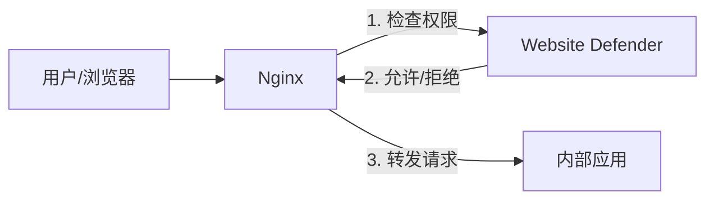

# Website Defender

`Website Defender` 是一个轻量级的 `WAF`（Web 应用防火墙），能够对暴露在公共网络下的网站提供额外的防护。

企业通常会部署许多内部应用，例如 `Gitlab`、`Jenkins`、`Prometheus`、`Nexus`、`Nacos` 等。当这些服务暴露在公网时，可能面临以下安全风险：
- 缺少统一的登录鉴权
- 暴力破解攻击
- 开源版本的安全漏洞

`Website Defender` 通过提供安全的网关、统一鉴权和访问控制策略来解决这些问题。

## 架构说明

`Website Defender` 设计为配合 **Nginx** 的 `auth_request` 模块使用。它作为一个独立的认证服务，在 Nginx 转发请求到您的实际应用之前验证用户身份。



## 功能特性

### 认证与访问控制

- **JWT 令牌认证**：安全的登录验证，支持可配置的令牌过期时间，通过 `Defender-Authorization` 请求头传递。
- **Cookie 认证**：支持 `flmelody.token` Cookie，实现无缝的浏览器会话。
- **Git Token 认证**：机器访问方式，通过可配置的 HTTP 请求头（默认 `Defender-Git-Token`），格式为 `username:token`。
- **许可证令牌认证**：API 访问方式，通过可配置的 HTTP 请求头（默认 `Defender-License`），令牌以 SHA-256 哈希存储。
- **IP 白名单**：允许特定 IP 或 CIDR 网段（如 `192.168.1.0/24`）直接跳过认证。
- **IP 黑名单**：通过精确匹配或 CIDR 网段封禁恶意 IP。

- **域名作用域访问控制**：通过逗号分隔的域名模式限制用户可访问的域名（如 `gitea.com, *.internal.org`）。作用域为空则不限制访问。管理员用户跳过作用域检查。域名通过 `X-Forwarded-Host` 请求头获取，回退到 `Host` 请求头。

**认证验证流程：**
```
IP 黑名单 → IP 白名单 → JWT 令牌（+ 作用域检查） → Git Token（+ 作用域检查） → 许可证令牌 → 拒绝
```

### 域名作用域

域名作用域实现了多租户访问控制，允许不同用户通过同一个 Defender 实例访问不同的受保护服务。

**工作原理：**

1. 当请求到达 `/auth` 时，Defender 从 `X-Forwarded-Host` 读取域名（回退到 `Host` 请求头）
2. 令牌/Git Token 认证成功后，检查用户的作用域是否匹配请求的域名
3. 如果域名不匹配任何作用域模式，返回 `403 Forbidden`

**作用域模式：**

| 模式 | 匹配 | 不匹配 |
|------|------|--------|
| `gitea.com` | `gitea.com` | `gitlab.com`、`sub.gitea.com` |
| `*.example.com` | `app.example.com`、`dev.example.com` | `example.com` |
| `gitea.com, *.internal.org` | `gitea.com`、`app.internal.org` | `gitlab.com` |
| *（空）* | 所有域名（不限制） | - |

**规则：**

- **作用域为空** = 不限制访问（向后兼容已有用户）
- **管理员用户** 始终跳过作用域检查，无论其作用域值如何
- 匹配**不区分大小写**
- 匹配前会自动剥离端口号（`gitea.com:3000` 匹配作用域 `gitea.com`）

**Nginx 配置：**

要将域名信息传递给 Defender，需配置 Nginx 通过 `X-Forwarded-Host` 转发 `Host` 请求头：

```nginx
server {
    server_name gitea.example.com;

    location / {
        auth_request /auth;

        # 将原始域名传递给 Defender 用于作用域检查
        proxy_pass http://gitea-backend;
    }

    location = /auth {
        internal;
        proxy_pass http://127.0.0.1:9999/wall/auth;
        proxy_set_header X-Forwarded-Host $host;
        proxy_set_header X-Forwarded-For $remote_addr;
        proxy_pass_request_body off;
        proxy_set_header Content-Length "";
    }
}
```

### Web 应用防火墙（WAF）

基于正则表达式的请求过滤，检查 URL 路径、查询参数、User-Agent 和请求体（最大 10KB）。每条规则支持 `block`（返回 403 拦截）或 `log`（放行但记录）动作。

**9 条内置规则：**

| 分类 | 规则 | 说明 |
|------|------|------|
| SQL 注入 | Union Select | 检测 `UNION SELECT` 联合查询攻击 |
| SQL 注入 | Common Patterns | 检测 `; DROP`、`; ALTER`、`; DELETE` 等破坏性语句 |
| SQL 注入 | Boolean Injection | 检测 `' OR 1=1` 等布尔型盲注 |
| SQL 注入 | Comment Injection | 检测 `' --` 和 `/* */` 注释注入 |
| XSS | Script Tag | 检测 `<script>` 标签注入 |
| XSS | Event Handler | 检测 `onerror=`、`onclick=` 等事件属性 |
| XSS | JavaScript Protocol | 检测 `javascript:` 和 `vbscript:` 协议 |
| 路径穿越 | Dot Dot Slash | 检测 `../`、`..\` 及 URL 编码变体 |
| 路径穿越 | Sensitive Files | 检测访问 `/etc/passwd`、`/proc/self` 等敏感文件 |

可通过管理后台添加自定义规则。

### 地域封锁（Geo-IP Blocking）

基于 MaxMind GeoLite2-Country 数据库，按国家/地区封锁请求。封锁的国家代码通过管理后台进行管理。

### 速率限制

- **全局限速**：每个 IP 可配置的每分钟请求数（默认 100 次）。
- **登录限速**：更严格的限制（默认 5 次/分钟），超出后自动锁定 IP（默认 5 分钟）。

### 安全响应头

所有响应自动附加安全头：
- `X-Content-Type-Options: nosniff`
- `X-XSS-Protection: 1; mode=block`
- `Referrer-Policy: strict-origin-when-cross-origin`
- `Permissions-Policy: camera=(), microphone=(), geolocation=()`
- `X-Frame-Options`（可配置，默认 `DENY`）
- `Strict-Transport-Security`（HSTS，可选）

### 访问日志与分析

所有请求均被记录，包括客户端 IP、请求方法、路径、状态码、延迟、User-Agent 和处理动作（放行/拦截）。仪表盘提供：
- 总请求数和拦截请求数
- 被拦截最多的 Top 10 IP
- 按 IP、动作、状态码和时间范围筛选

### 用户管理

- 创建、编辑和删除管理员用户
- 角色控制（管理员权限标识）
- 一键生成 Git Token 并复制
- **域名作用域**：限制每个用户可访问的受保护域名

### 许可证管理

- 生成许可证令牌用于 API/机器访问
- 令牌仅显示一次，以哈希形式安全存储
- 通过管理后台激活/吊销许可证

### 管理后台

- 实时统计数据（请求数、拦截数、运行时间）
- 用户、IP 名单、WAF 规则、访问日志、地域封锁、许可证和系统设置管理
- 黑客风格终端 UI
- **支持 6 种语言**：英语、中文、德语、法语、日语、俄语

### 多数据库支持

| 数据库 | 默认配置 |
|--------|---------|
| **SQLite**（默认） | `./data/app.db` |
| **PostgreSQL** | `localhost:5432` |
| **MySQL** | `localhost:3306` |

### 部署

- 单文件部署，前端资源通过 `go:embed` 嵌入
- 通过 `config/config.yaml` 或环境变量配置
- 支持优雅关停
- 可配置信任代理

## 截图预览

### 防护页面 (Guard)


### 管理后台 (Admin)
[](https://www.bilibili.com/video/BV1CYUZBdEqv?t=8.8 "Open Website Defender")

## 快速开始

### 环境要求
- Go 1.25+
- Node.js 20+
- Nginx（需包含 `auth_request` 模块）

### 构建

项目包含一个构建脚本，用于编译前端和后端代码。

```bash
# 1. 克隆仓库
git clone https://github.com/Flmelody/open-website-defender.git
cd open-website-defender

# 2. 构建项目
# 您可以通过修改 scripts/build.sh 或设置环境变量来自定义构建配置
./scripts/build.sh
```

### 运行

构建完成后，根目录下会生成一个名为 `app` 的可执行文件。

```bash
# 运行应用
./app
```

应用将使用默认配置启动。
- **管理后台地址**: `http://localhost:9999/wall/admin/`
- **默认用户名**: `defender`
- **默认密码**: `defender`

## 配置说明

您可以通过 `config/config.yaml` 配置文件或环境变量来配置应用。

### 环境变量（构建时）
- `BACKEND_HOST`: 后端 API 地址（默认: `http://localhost:9999/wall`）
- `ROOT_PATH`: 根路径上下文（默认: `/wall`）
- `ADMIN_PATH`: 管理后台路径（默认: `/admin`）
- `GUARD_PATH`: 防护页/登录页路径（默认: `/guard`）

### 运行时配置（`config/config.yaml`）

```yaml
# 数据库: sqlite（默认）、postgres、mysql
database:
  driver: sqlite

# JWT 和 CORS 设置
security:
  jwt-secret: ""
  token-expiration-hours: 24

# 速率限制
rate-limit:
  enabled: true
  requests-per-minute: 100
  login:
    requests-per-minute: 5
    lockout-duration: 300

# WAF（SQL 注入、XSS、路径穿越检测）
request-filtering:
  enabled: true

# 地域封锁（需要 MaxMind MMDB 文件）
geo-blocking:
  enabled: false
  database-path: ""
```

## API 参考

所有路由均以可配置的 `ROOT_PATH`（默认 `/wall`）为前缀。

| 方法 | 路径 | 说明 | 鉴权 |
|------|------|------|------|
| `POST` | `/login` | 用户登录 | 否 |
| `GET` | `/auth` | 验证凭证（IP 名单 + 令牌） | 否 |
| `GET` | `/health` | 健康检查 | 否 |
| `GET` | `/dashboard/stats` | 仪表盘统计数据 | 是 |
| `POST/GET/PUT/DELETE` | `/users[/:id]` | 用户管理 | 是 |
| `POST/GET/DELETE` | `/ip-black-list[/:id]` | IP 黑名单管理 | 是 |
| `POST/GET/DELETE` | `/ip-white-list[/:id]` | IP 白名单管理 | 是 |
| `POST/GET/PUT/DELETE` | `/waf-rules[/:id]` | WAF 规则管理 | 是 |
| `GET` | `/access-logs` | 访问日志查询 | 是 |
| `GET` | `/access-logs/stats` | 访问日志统计 | 是 |
| `POST/GET/DELETE` | `/geo-block-rules[/:id]` | 地域封锁管理 | 是 |
| `POST/GET/DELETE` | `/licenses[/:id]` | 许可证管理 | 是 |
| `GET/PUT` | `/system/settings` | 系统设置 | 是 |
| `POST` | `/system/reload` | 重载配置并清除缓存 | 是 |

## 中间件链

请求按以下顺序依次通过中间件：

```
安全响应头 → CORS → 请求体限制 → 访问日志 → 地域封锁 → WAF → 速率限制 → 路由处理
```

## License

Copyright (c) 2023 Flmelody, All rights reserved.

本文件根据 GNU 通用公共许可证第 3 版（GPLv3）（以下简称"许可证"）授权； 除非遵守该许可证，否则您不得使用本文件。
您可通过以下网址获取许可证副本：

https://www.gnu.org/licenses/gpl-3.0.html

除非适用法律要求或书面同意，根据本许可分发的软件均按"原样"提供，不附带任何形式的明示或暗示的保证或条件。有关许可权限与限制的具体条款，请参阅本许可文本。

## 支持

如需获得额外技术支持/定制化等服务，可随时[联系我们](mailto:studiofm@163.com)
