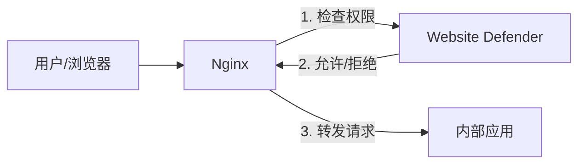

# Website Defender

`Website Defender` 是一个轻量级的 `WAF`（Web 应用防火墙），能够对暴露在公共网络下的网站提供额外的防护。

企业通常会部署许多内部应用，例如 `Gitlab`、`Jenkins`、`Prometheus`、`Nexus`、`Nacos` 等。当这些服务暴露在公网时，可能面临以下安全风险：
- 缺少统一的登录鉴权
- 暴力破解攻击
- 开源版本的安全漏洞

`Website Defender` 通过提供安全的网关、统一鉴权和访问控制策略来解决这些问题。

## 架构说明

`Website Defender` 设计为配合 **Nginx** 的 `auth_request` 模块使用。它作为一个独立的认证服务，在 Nginx 转发请求到您的实际应用之前验证用户身份。



## 功能特性

- **🛡️ 登录鉴权**：为您的应用添加一层安全的登录验证。
- **⚪ IP 白名单**：允许特定 IP 直接访问服务，无需登录。
- **⚫ IP 黑名单**：禁止恶意 IP 访问您的服务。
- **👥 用户管理**：管理系统用户和访问凭证。
- **📊 可视化面板**：简单易用的管理后台。

## 截图预览

### 防护页面 (Guard)


### 管理后台 (Admin)
[](https://www.bilibili.com/video/BV1CYUZBdEqv?t=8.8 "Open Website Defender")

## 快速开始

### 环境要求
- Go 1.25+
- Node.js 20+
- Nginx (需包含 `auth_request` 模块)

### 构建

项目包含一个构建脚本，用于编译前端和后端代码。

```bash
# 1. 克隆仓库
git clone https://github.com/Flmelody/open-website-defender.git
cd open-website-defender

# 2. 构建项目
# 您可以通过修改 scripts/build.sh 或设置环境变量来自定义构建配置
./scripts/build.sh
```

### 运行

构建完成后，根目录下会生成一个名为 `app` 的可执行文件。

```bash
# 运行应用
./app
```

应用将使用默认配置启动。
- **管理后台地址**: `http://localhost:9999/wall/admin/`
- **默认用户名**: `defender`
- **默认密码**: `defender`

## 配置说明

您可以通过 `config/config.yaml` 配置文件或环境变量来配置应用。

### 环境变量 (构建时)
- `BACKEND_HOST`: 后端 API 地址 (默认: `http://localhost:9999/wall`)
- `ROOT_PATH`: 根路径上下文 (默认: `/wall`)
- `ADMIN_PATH`: 管理后台路径 (默认: `/admin`)
- `GUARD_PATH`: 防护页/登录页路径 (默认: `/guard`)

## License

Copyright (c) 2023 Flmelody, All rights reserved.

本文件根据 GNU 通用公共许可证第 3 版（GPLv3）（以下简称“许可证”）授权； 除非遵守该许可证，否则您不得使用本文件。
您可通过以下网址获取许可证副本：

https://www.gnu.org/licenses/gpl-3.0.html

除非适用法律要求或书面同意，根据本许可分发的软件均按“原样”提供，不附带任何形式的明示或暗示的保证或条件。有关许可权限与限制的具体条款，请参阅本许可文本。

## 支持

如需获得额外技术支持/定制化等服务，可随时[联系我们](mailto:studiofm@163.com)
