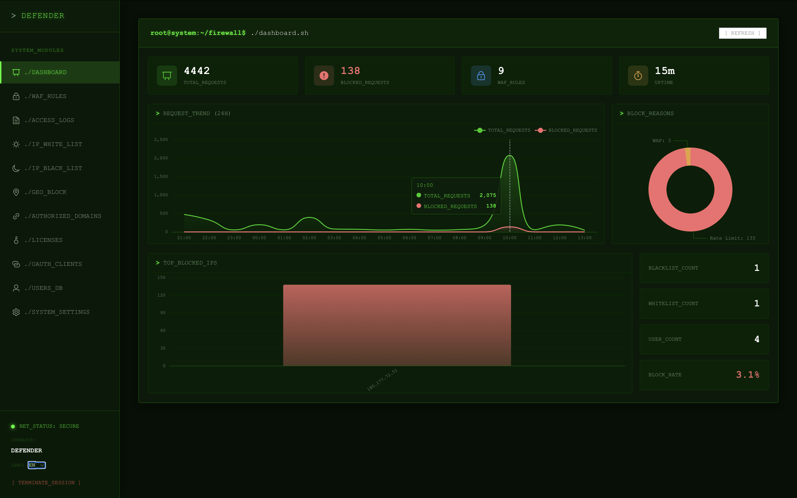
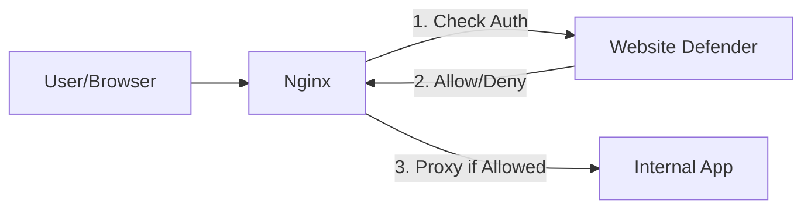

# Website Defender

[中文文档](README-zh.md)

A **self-hosted**, **lightweight**, **simple** WAF (Web Application Firewall) -- single binary, deploy in minutes.

`Website Defender` provides unified authentication, intelligent threat detection, and multi-layer access control for websites exposed on public networks. No agents to install, no cloud subscriptions -- just one binary in front of Nginx.



Enterprises often deploy many internal applications such as `Gitlab`, `Jenkins`, `Prometheus`, `Nexus`, `Nacos`, etc. When exposed, these services may face security risks like:
- Lack of unified authentication
- Brute-force attacks
- Vulnerabilities in open-source versions

`Website Defender` addresses these issues by providing a self-hosted security gateway with authentication and access control policies -- **no code changes required** for your existing applications.

## Architecture

`Website Defender` is designed to work with **Nginx** using the `auth_request` module. It acts as an authentication provider that validates requests before Nginx forwards them to your actual applications.



## Features

### Authentication & Access Control

- **JWT Token Authentication**: Secure login with configurable token expiration, issued via `Defender-Authorization` header.
- **Cookie-based Authentication**: Supports `flmelody.token` cookie for seamless browser sessions.
- **Git Token Authentication**: Machine access via configurable HTTP header (default `Defender-Git-Token`), format `username:token`.
- **License Token Authentication**: API access via configurable HTTP header (default `Defender-License`), tokens are SHA-256 hashed before storage.
- **IP Whitelist**: Allow specific IPs or CIDR ranges (e.g. `192.168.1.0/24`) to bypass authentication.
- **IP Blacklist**: Block malicious IPs by exact match or CIDR range. Supports temporary bans with auto-expiry and optional remarks.

- **Authorized Domains**: Centrally manage protected domains. Used as the data source for IP whitelist domain binding and user access control.
- **Authorized Domain Access Control**: Restrict users to specific authorized domains using comma-separated patterns (e.g. `gitea.com, *.internal.org`). Empty authorized domains grant unrestricted access. Admin users bypass authorized domain checks. Domain is determined from `X-Forwarded-Host` header with fallback to `Host`.

**Auth verification flow:**
```
IP Blacklist → IP Whitelist (+ Authorized Domain Check) → JWT Token (+ Authorized Domain Check) → Git Token (+ Authorized Domain Check) → License Token → Deny
```

### Authorized Domain Access Control

Authorized domains enable multi-tenant access control, allowing different users to access different protected services behind the same Defender instance.

**How it works:**

1. When a request hits `/auth`, Defender reads the domain from `X-Forwarded-Host` (fallback: `Host` header)
2. After successful token/git-token authentication, the user's authorized domains are checked against the requested domain
3. If the domain doesn't match any authorized domain pattern, a `403 Forbidden` is returned

**Authorized domain patterns:**

| Pattern | Matches | Does Not Match |
|---------|---------|----------------|
| `gitea.com` | `gitea.com` | `gitlab.com`, `sub.gitea.com` |
| `*.example.com` | `app.example.com`, `dev.example.com` | `example.com` |
| `gitea.com, *.internal.org` | `gitea.com`, `app.internal.org` | `gitlab.com` |
| *(empty)* | Everything (unrestricted) | - |

**Rules:**

- **Empty authorized domains** = unrestricted access (backwards compatible with existing users)
- **Admin users** always bypass authorized domain checks regardless of their configuration
- Matching is **case-insensitive**
- Ports are stripped before matching (`gitea.com:3000` matches `gitea.com`)

**Nginx configuration:**

To pass the domain information to Defender, configure Nginx to forward the `Host` header via `X-Forwarded-Host`:

```nginx
server {
    server_name gitea.example.com;

    location / {
        auth_request /auth;

        # Pass the original host to Defender for authorized domain checking
        proxy_pass http://gitea-backend;
    }

    location = /auth {
        internal;
        proxy_pass http://127.0.0.1:9999/wall/auth;
        proxy_set_header X-Forwarded-Host $host;
        proxy_set_header X-Forwarded-For $remote_addr;
        proxy_set_header X-Original-URI $request_uri;
        proxy_pass_request_body off;
        proxy_set_header Content-Length "";
    }
}
```

### Web Application Firewall (WAF)

Regex-based request filtering that inspects URL path, query string, User-Agent, and request body (up to 10KB). Each rule supports `block` (return 403) or `log` (allow but record) actions.

**9 built-in rules:**

| Category | Rule | Description |
|----------|------|-------------|
| SQL Injection | Union Select | Detects `UNION SELECT` based attacks |
| SQL Injection | Common Patterns | Detects `; DROP`, `; ALTER`, `; DELETE`, etc. |
| SQL Injection | Boolean Injection | Detects `' OR 1=1` style bypass |
| SQL Injection | Comment Injection | Detects `' --` and `/* */` comment abuse |
| XSS | Script Tag | Detects `<script>` tag injection |
| XSS | Event Handler | Detects `onerror=`, `onclick=`, etc. |
| XSS | JavaScript Protocol | Detects `javascript:` and `vbscript:` |
| Path Traversal | Dot Dot Slash | Detects `../`, `..\`, and URL-encoded variants |
| Path Traversal | Sensitive Files | Detects `/etc/passwd`, `/proc/self`, etc. |

Custom rules can be added via the admin dashboard.

### Threat Detection & Auto-Ban

Automatic detection and blocking of malicious behavior patterns with configurable thresholds:

- **4xx Error Flood**: Ban IPs after excessive client errors (default: 20 in 60s → 1h ban)
- **Path Scanning**: Detect systematic 404 probing (default: 10 in 5min → 4h ban)
- **Rate Limit Abuse**: Catch repeated rate limit hits (default: 5 in 5min → 2h ban)
- **Brute Force**: Block IPs with excessive failed logins (default: 10 in 10min → 1h ban)
- **Threat Scoring**: Dynamic per-IP threat score (WAF blocks +5, rate limits +3, 4xx +1) with 1h decay

### JS Challenge (Proof-of-Work)

JavaScript-based Proof-of-Work challenge to filter bots:

- **Modes**: `off`, `suspicious` (only high-threat IPs), `all` (every new visitor)
- SHA256 PoW with configurable difficulty (1-6 leading zeros)
- Pass cookie valid for 24h per IP
- Automatically bypasses whitelisted IPs, authenticated requests, and non-browser clients

### Security Events

Centralized security event tracking and analysis:

- Event types: `auto_ban`, `brute_force`, `scan_detected`, `js_challenge_fail`
- Statistics: total events, 24h auto-bans, top threat IPs, event type breakdown
- Filterable by event type, IP, and time range
- 90-day automatic retention with async buffered writes

### Webhook Notifications

HTTP POST notifications to external systems when security events occur:

- Configurable endpoint URL and event type filtering
- Async delivery with 5-second timeout
- Payload includes event type, client IP, reason, ban duration, and timestamp

### Geo-IP Blocking

Block requests by country using MaxMind GeoLite2-Country database. Country codes are managed via the admin dashboard.

### Rate Limiting

- **Global**: Configurable requests-per-minute per IP (default 100).
- **Login-specific**: Stricter limit (default 5/min) with automatic IP lockout (default 5 minutes).

### Security Headers

Automatic security headers on all responses:
- `X-Content-Type-Options: nosniff`
- `X-XSS-Protection: 1; mode=block`
- `Referrer-Policy: strict-origin-when-cross-origin`
- `Permissions-Policy: camera=(), microphone=(), geolocation=()`
- `X-Frame-Options` (configurable, default `DENY`)
- `Strict-Transport-Security` (HSTS, optional)

### Access Logging & Analytics

All requests are logged with client IP, method, path, status code, latency, User-Agent, and action (allowed/blocked). Access log data feeds into the threat detection engine in real time. The dashboard provides:
- Total and blocked request counts
- Top 10 blocked IPs
- Auto-bans in past 24 hours, active threat count
- Filtering by IP, action, status code, and time range

### Authorized Domain Management

- Centrally register and manage all protected domains
- Serves as data source for IP whitelist domain binding and user access control
- Deleting an authorized domain automatically cleans up related IP whitelist entries and user authorized domain references

### User Management

- Create, edit, and delete admin users
- Role-based access (admin privilege flag)
- **Account enable/disable**: toggle accounts on/off without deletion; disabled accounts are blocked from all auth methods
- Auto-generate Git tokens with one-click copy
- **Authorized domains**: restrict which protected domains each user can access (selectable from registered authorized domains)
- **2FA recovery**: config-based recovery key for resetting admin 2FA when locked out (localhost-only by default)

### License Management

- Generate license tokens for API/machine access
- Tokens shown once and hashed for secure storage
- Activate/revoke licenses via admin dashboard

### Admin Dashboard

- Real-time statistics (requests, blocks, uptime, auto-bans, active threats)
- User, IP list, authorized domain, WAF rule, access log, security events, geo-block, license, and system settings management
- JS Challenge and Webhook configuration via system settings
- Hacker-themed terminal UI
- **6 languages**: English, Chinese, German, French, Japanese, Russian

### Multi-Database Support

| Database | Default Config |
|----------|---------------|
| **SQLite** (default) | `./data/app.db` |
| **PostgreSQL** | `localhost:5432` |
| **MySQL** | `localhost:3306` |

### Deployment

- **Single-binary, self-hosted** -- no external services, no cloud dependencies, no Docker required
- Frontend assets embedded via `go:embed` -- nothing else to deploy
- Configurable via `config/config.yaml` or environment variables
- Graceful shutdown support
- Trusted proxy configuration

## Screenshots

### Guard Page (Interception)


### Admin Dashboard
[](https://www.bilibili.com/video/BV1CYUZBdEqv?t=8.8 "Open Website Defender")

## Quick Start

### Prerequisites
- Go 1.25+
- Node.js 20+
- Nginx (with `auth_request` module)

### Build

The project includes a build script to compile both the frontend and backend.

```bash
# 1. Clone the repository
git clone https://github.com/Flmelody/open-website-defender.git
cd open-website-defender

# 2. Build the project
# You can customize the build environments in scripts/build.sh or via environment variables
./scripts/build.sh
```

### Run

After building, an executable file named `app` will be generated in the root directory.

```bash
# Run the application
./app
```

The application will start with the default configuration.
- **Admin URL**: `http://localhost:9999/wall/admin/`
- **Default User**: `defender`
- **Default Password**: `defender`

## Configuration

You can configure the application using `config/config.yaml` or environment variables.

### Environment Variables (Build Time)
- `BACKEND_HOST`: The backend API host (default: `http://localhost:9999/wall`)
- `ROOT_PATH`: The root path context (default: `/wall`)
- `ADMIN_PATH`: The path for the admin dashboard (default: `/admin`)
- `GUARD_PATH`: The path for the guard login page (default: `/guard`)

### Runtime Configuration (`config/config.yaml`)

```yaml
# Database: sqlite (default), postgres, mysql
database:
  driver: sqlite

# JWT and CORS settings
security:
  jwt-secret: ""
  token-expiration-hours: 24

# Rate limiting
rate-limit:
  enabled: true
  requests-per-minute: 100
  login:
    requests-per-minute: 5
    lockout-duration: 300

# WAF (SQL injection, XSS, path traversal detection)
request-filtering:
  enabled: true

# Geo-IP blocking (requires MaxMind MMDB file)
geo-blocking:
  enabled: false
  database-path: ""

# Threat detection (auto-ban on anomalous behavior)
threat-detection:
  enabled: true

# JS Challenge (Proof-of-Work)
js-challenge:
  enabled: false
  mode: "suspicious"    # off | suspicious | all
  difficulty: 4

# Webhook notifications
webhook:
  url: ""
  events: [auto_ban, brute_force, scan_detected]
```

## API Reference

All routes are prefixed with the configurable `ROOT_PATH` (default `/wall`).

| Method | Path | Description | Auth |
|--------|------|-------------|------|
| `POST` | `/login` | User authentication | No |
| `POST` | `/admin-login` | Admin-only authentication (rejects non-admin users with 403) | No |
| `POST` | `/admin-recover-2fa` | Reset admin 2FA with recovery key (localhost-only by default) | No |
| `GET` | `/auth` | Verify credentials (IP lists + token) | No |
| `GET` | `/health` | Health check | No |
| `GET` | `/dashboard/stats` | Dashboard statistics | Yes |
| `POST/GET/PUT/DELETE` | `/users[/:id]` | User CRUD | Yes |
| `POST/GET/DELETE` | `/ip-black-list[/:id]` | IP blacklist management | Yes |
| `POST/GET/PUT/DELETE` | `/ip-white-list[/:id]` | IP whitelist management | Yes |
| `POST/GET/PUT/DELETE` | `/waf-rules[/:id]` | WAF rule management | Yes |
| `GET` | `/access-logs` | Access log query | Yes |
| `GET` | `/access-logs/stats` | Access log statistics | Yes |
| `POST/GET/DELETE` | `/authorized-domains[/:id]` | Authorized domain management | Yes |
| `POST/GET/DELETE` | `/geo-block-rules[/:id]` | Geo-blocking management | Yes |
| `POST/GET/DELETE` | `/licenses[/:id]` | License management | Yes |
| `GET` | `/security-events` | Security events list | Yes |
| `GET` | `/security-events/stats` | Security event statistics | Yes |
| `GET/PUT` | `/system/settings` | System settings | Yes |
| `POST` | `/system/reload` | Reload configuration & clear caches | Yes |

## Middleware Chain

Requests pass through the following middleware in order:

```
SecurityHeaders → CORS → BodyLimit → AccessLog → GeoBlock → WAF → RateLimiter → JS Challenge → Route Handler
```

## License

Copyright (c) 2023 Flmelody, All rights reserved.

Licensed under The GNU General Public License version 3 (GPLv3) (the "License"); you may not use this file except in compliance with the License. You may obtain a copy of the License at

https://www.gnu.org/licenses/gpl-3.0.html

Unless required by applicable law or agreed to in writing, software distributed under the License is distributed on an "AS IS" BASIS, WITHOUT WARRANTIES OR CONDITIONS OF ANY KIND, either express or implied. See the License for the specific language governing permissions and limitations under the License.

## Support

If you need additional technical support or customization services, feel free to [contact us](mailto:studiofm@163.com).
