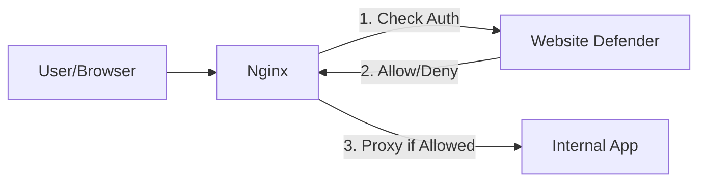

# Website Defender

[中文文档](README-zh.md)

`Website Defender` is a lightweight `WAF` (Web Application Firewall) designed to provide additional protection for websites exposed on public networks.

Enterprises often deploy many internal applications such as `Gitlab`, `Jenkins`, `Prometheus`, `Nexus`, `Nacos`, etc. When exposed, these services may face security risks like:
- Lack of unified authentication
- Brute-force attacks
- Vulnerabilities in open-source versions

`Website Defender` addresses these issues by providing a secure gateway with authentication and access control policies.

## Architecture

`Website Defender` is designed to work with **Nginx** using the `auth_request` module. It acts as an authentication provider that validates requests before Nginx forwards them to your actual applications.



## Features

- **🛡️ Login Authentication**: Adds a secure login layer to your applications.
- **⚪ IP Whitelist**: Allow specific IPs to access services directly without authentication.
- **⚫ IP Blacklist**: Block malicious IPs from accessing your services.
- **👥 User Management**: Manage administrative users and access credentials.
- **📊 Visual Dashboard**: Easy-to-use admin interface for configuration.

## Screenshots

### Guard Page (Interception)


### Admin Dashboard
[](https://www.bilibili.com/video/BV1CYUZBdEqv?t=8.8 "Open Website Defender")

## Quick Start

### Prerequisites
- Go 1.25+
- Node.js 20+
- Nginx (with `auth_request` module)

### Build

The project includes a build script to compile both the frontend and backend.

```bash
# 1. Clone the repository
git clone https://github.com/Flmelody/open-website-defender.git
cd open-website-defender

# 2. Build the project
# You can customize the build environments in scripts/build.sh or via environment variables
./scripts/build.sh
```

### Run

After building, an executable file named `app` will be generated in the root directory.

```bash
# Run the application
./app
```

The application will start with the default configuration.
- **Admin URL**: `http://localhost:9999/wall/admin/`
- **Default User**: `defender`
- **Default Password**: `defender`

## Configuration

You can configure the application using `config/config.yaml` or environment variables.

### Environment Variables (Build Time)
- `BACKEND_HOST`: The backend API host (default: `http://localhost:9999/wall`)
- `ROOT_PATH`: The root path context (default: `/wall`)
- `ADMIN_PATH`: The path for the admin dashboard (default: `/admin`)
- `GUARD_PATH`: The path for the guard login page (default: `/guard`)

## License

Copyright (c) 2023 Flmelody, All rights reserved.

Licensed under The GNU General Public License version 3 (GPLv3) (the "License"); you may not use this file except in compliance with the License. You may obtain a copy of the License at

https://www.gnu.org/licenses/gpl-3.0.html

Unless required by applicable law or agreed to in writing, software distributed under the License is distributed on an "AS IS" BASIS, WITHOUT WARRANTIES OR CONDITIONS OF ANY KIND, either express or implied. See the License for the specific language governing permissions and limitations under the License.

## Support

If you need additional technical support or customization services, feel free to [contact us](mailto:studiofm@163.com).
