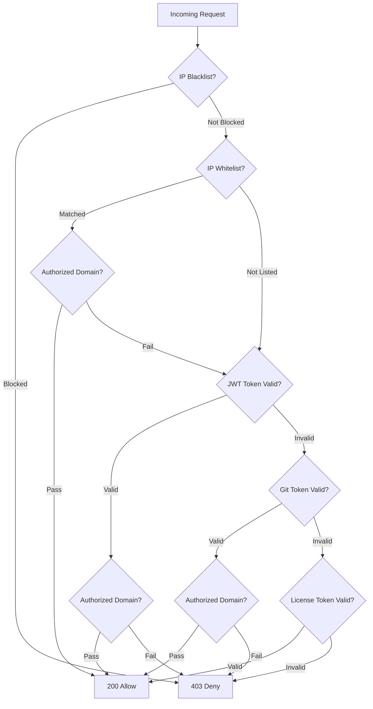

# Architecture

Website Defender is designed to work with **Nginx** using the `auth_request` module. It acts as an authentication and security provider that validates every request before Nginx forwards traffic to your actual applications.

## Request Flow

When a user makes a request to a protected application, Nginx first consults Website Defender to decide whether to allow or deny the request.


1. **User** sends a request to Nginx
2. **Nginx** makes an internal subrequest to Website Defender's `/auth` endpoint
3. **Website Defender** evaluates the request through its security pipeline
4. If allowed, **Nginx** proxies the request to the internal application
5. If denied, the user is redirected to the guard (challenge) page or receives a 403 response

## Middleware Chain

Every request to Website Defender passes through the following middleware in order:

```
SecurityHeaders → CORS → BodyLimit → AccessLog → GeoBlock → WAF → RateLimiter → Route Handler
```

| Middleware | Purpose |
|-----------|---------|
| **SecurityHeaders** | Adds hardening headers (`X-Content-Type-Options`, HSTS, etc.) |
| **CORS** | Handles Cross-Origin Resource Sharing |
| **BodyLimit** | Enforces maximum request body size |
| **AccessLog** | Records request details for analytics |
| **GeoBlock** | Blocks requests from restricted countries |
| **WAF** | Inspects URL, query, User-Agent, and body for attack patterns |
| **RateLimiter** | Enforces per-IP request rate limits |
| **Route Handler** | Processes the actual API endpoint logic |

!!! info "Middleware Order Matters"
    The middleware chain is ordered intentionally. For example, geo-blocking and WAF checks happen before rate limiting so that clearly malicious requests are blocked without consuming rate limit quota.

## Auth Verification Flow

When the `/auth` endpoint is called, Website Defender evaluates the request through a series of checks in strict order:



```
IP Blacklist → IP Whitelist (+ Authorized Domain Check) → JWT Token (+ Authorized Domain Check) → Git Token (+ Authorized Domain Check) → License Token → Deny
```

!!! note "Short-Circuit Evaluation"
    The auth flow short-circuits at the first definitive result. A blacklisted IP is immediately denied. A whitelisted IP is allowed only if its bound domain matches the requested domain (or if no domain is bound); otherwise the request falls through to token-based authentication.

## Single-Binary Deployment

Website Defender compiles into a **single binary** with all frontend assets embedded via Go's `go:embed` directive. This means:

- No external file dependencies for the UI
- Simple deployment -- just copy the binary and optional config file
- Both the admin dashboard and guard page are served directly by the Go backend

For more details, see [Deployment](../deployment/index.md).

## Data Model

The core data entities and their relationships:

- **Authorized Domains** -- central registry of all protected domains
- **IP Whitelist** -- entries can be bound to an authorized domain; only grants access when the requested domain matches the bound domain
- **Users** -- authorized domains restrict which protected services each user can access
- **IP Blacklist**, **WAF Rules**, **Geo-Block Rules**, **Licenses** -- independent entities managed via the admin dashboard
