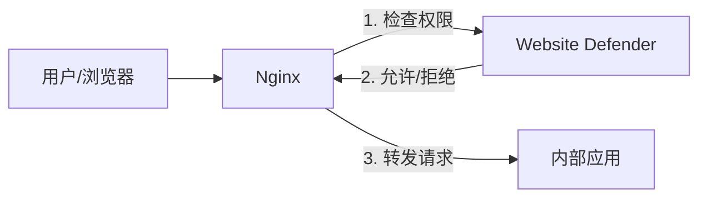
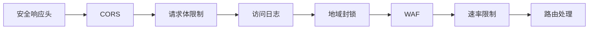
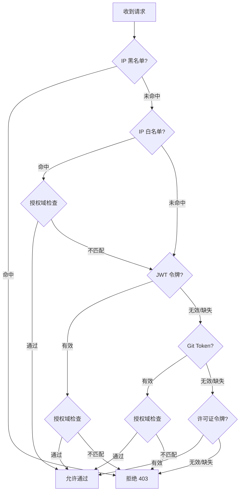

# 架构说明

## 整体架构

`Website Defender` 设计为配合 **Nginx** 的 `auth_request` 模块使用。它作为一个独立的认证服务，在 Nginx 转发请求到您的实际应用之前验证用户身份。



**工作流程：**

1. 用户发起请求到 Nginx
2. Nginx 通过 `auth_request` 指令向 Website Defender 发起子请求
3. Defender 执行完整的认证和安全检查，返回允许或拒绝
4. 如果认证通过，Nginx 将原始请求转发到内部应用；否则返回拒绝响应

!!! info "关于 auth_request"
    `auth_request` 是 Nginx 的一个标准模块，允许 Nginx 在处理请求之前，先向外部认证服务发起子请求。Defender 利用此机制实现透明的认证代理，无需修改内部应用代码。

---

## 中间件链

请求到达 Defender 后，按以下顺序依次通过中间件处理：



| 顺序 | 中间件 | 说明 |
|------|--------|------|
| 1 | **安全响应头** | 自动附加安全头（X-Content-Type-Options、X-XSS-Protection 等） |
| 2 | **CORS** | 跨域资源共享策略 |
| 3 | **请求体限制** | 限制请求体大小（默认 10MB） |
| 4 | **访问日志** | 记录所有请求信息（IP、方法、路径、状态码等） |
| 5 | **地域封锁** | 基于 GeoIP 按国家/地区封锁请求 |
| 6 | **WAF** | Web 应用防火墙，检测 SQL 注入、XSS、路径穿越等攻击 |
| 7 | **速率限制** | 全局限速与登录限速 |
| 8 | **路由处理** | 执行具体的业务逻辑 |

---

## 认证流程

当请求到达 `/auth` 端点时，Defender 按以下顺序执行认证检查：



**认证验证流程（简化表示）：**

```
IP 黑名单 → IP 白名单（+ 授权域检查） → JWT 令牌（+ 授权域检查） → Git Token（+ 授权域检查） → 许可证令牌 → 拒绝
```

!!! note "认证优先级"
    - IP 黑名单优先级最高，命中即拒绝
    - IP 白名单命中后检查绑定的授权域，匹配则放行；不匹配则继续令牌认证
    - 多种令牌认证按顺序尝试，任一通过即放行
    - 管理员用户始终跳过授权域检查

---

## 数据模型

核心数据实体及其关系：

- **授权域** -- 所有受保护域名的集中注册表
- **IP 白名单** -- 条目可绑定授权域；仅当请求的域名匹配绑定的授权域时才放行
- **用户** -- 授权域限制每个用户可以访问哪些受保护的服务
- **IP 黑名单**、**WAF 规则**、**地域封锁规则**、**许可证** -- 独立实体，通过管理后台管理

---

## 相关页面

- [授权域管理](../features/authorized-domains.md) - 集中管理受保护域名及多租户访问控制
- [认证与访问控制](../features/authentication.md) - 详细了解各种认证方式
- [Nginx 配置](../deployment/nginx-setup.md) - 配置 Nginx 集成 Defender
