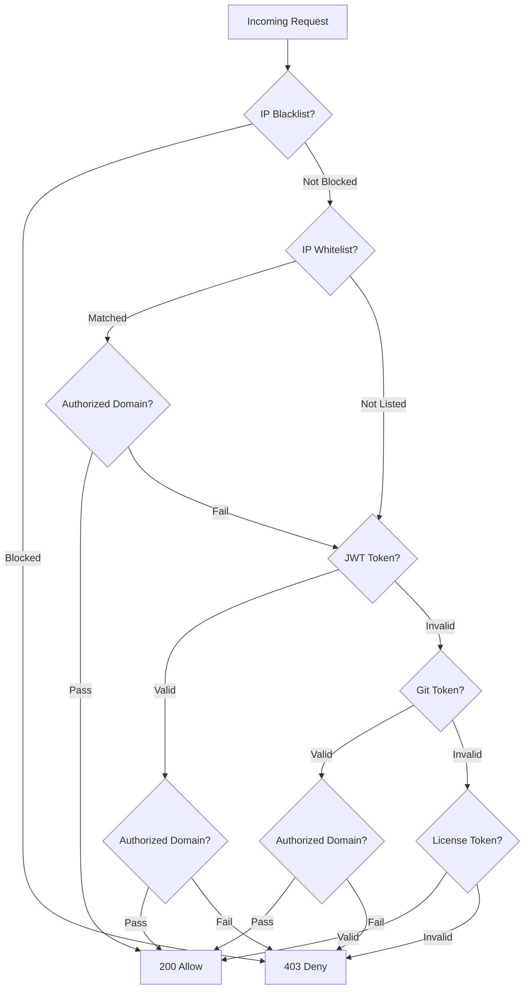

# Authentication & Access Control

Website Defender supports multiple authentication methods to accommodate different access patterns -- from interactive browser sessions to automated machine access.

## JWT Token Authentication

The primary authentication method. Users authenticate via the `/login` endpoint (or `/admin-login` for admin-only access) and receive a JWT token.

- Tokens are issued in the `Defender-Authorization` response header
- Token expiration is configurable (default: 24 hours)
- The JWT secret can be set in `config/config.yaml`; if left empty, a random key is generated on each restart

!!! warning "JWT Secret in Production"
    Always set a stable `jwt-secret` in production. An empty secret causes tokens to be invalidated on every application restart.

```yaml
security:
  jwt-secret: "your-secure-secret-here"
  token-expiration-hours: 24
```

## Two-Factor Authentication (2FA)

Website Defender supports TOTP-based two-factor authentication for both admin and guard login flows. When 2FA is enabled for a user, they must provide a 6-digit code from an authenticator app (Google Authenticator, Authy, etc.) after entering their username and password.

- 2FA can be enabled per user through the admin dashboard
- Supports standard TOTP apps (Google Authenticator, Authy, Microsoft Authenticator, etc.)
- Applies to both `/login` (guard) and `/admin-login` (admin dashboard) flows
- Administrators can reset 2FA for any user via the admin dashboard

### 2FA Recovery

If an administrator loses access to their authenticator app and no other admin can reset their 2FA, a **config-based recovery mechanism** is available:

1. Set a `admin-recovery-key` in `config/config.yaml`
2. Call `POST /admin-recover-2fa` with the admin's username, password, and recovery key
3. The admin's 2FA will be reset, allowing them to log in with just username and password

```yaml
security:
  admin-recovery-key: "your-secret-recovery-key"
  admin-recovery-local-only: true  # restrict to localhost (recommended)
```

!!! warning "Recovery Key Security"
    - By default, the recovery endpoint only accepts requests from **localhost** (`admin-recovery-local-only: true`). This prevents remote exploitation even if the key is leaked.
    - Leave `admin-recovery-key` empty to completely disable the recovery endpoint.
    - The recovery endpoint requires valid username and password in addition to the recovery key.

### Trusted Devices

After successful 2FA verification, users can choose to mark their device as trusted. A trusted device stores a secure token (via cookie) that allows subsequent logins to skip the 2FA step for a configurable period.

- Default trust duration: **7 days**
- Configured via `security.trusted-device-days` in `config/config.yaml`
- Set to `0` to disable trusted devices entirely (2FA will be required on every login)
- When a user's 2FA is disabled or reset, all their trusted device tokens are automatically invalidated

```yaml
security:
  trusted-device-days: 7  # set to 0 to disable
```

!!! note "How It Works"
    On each login, if the request includes a valid trusted device token, the server verifies it against the database. If the token is valid and not expired, 2FA is bypassed and a JWT is issued directly. When a user completes 2FA and opts to trust the device, a cryptographically random token is generated, stored in the database with an expiration timestamp, and returned to the client.

For 2FA management details, see [User Management](user-management.md).

## Cookie-based Authentication

For seamless browser sessions, Website Defender also supports authentication via the `flmelody.token` cookie. This allows users to navigate between protected applications without re-authenticating, as long as they share the same cookie domain.

## Git Token Authentication

Designed for machine access (CI/CD pipelines, scripts, automated tools). Git tokens are sent via a configurable HTTP header (default: `Defender-Git-Token`).

- Token format: `username:token`
- Tokens are auto-generated per user via the admin dashboard
- One-click copy for easy integration

!!! tip "Use Git Tokens for Automation"
    Git tokens are ideal for integrating with tools like Git clients, CI runners, or monitoring systems that need to access protected services without interactive login.

### Auto-Trust (Temporary Whitelist)

When a request is successfully authenticated via a git token, the client IP is automatically added to a **temporary whitelist** for the requested domain. This temporary entry lasts for 300 seconds (5 minutes) and is automatically renewed on each subsequent git token authentication from the same IP.

This mechanism is designed to improve performance for git operations (such as `git clone` or `git push`) that trigger many sequential HTTP requests. After the initial git token authentication, follow-up requests from the same IP are matched by the whitelist and skip token validation entirely.

- Temporary whitelist entries are scoped to the specific domain of the original request
- Entries expire automatically after 5 minutes of inactivity
- If a permanent whitelist entry already covers the IP and domain, no temporary entry is created
- Temporary entries are visible in the admin dashboard alongside regular whitelist entries

## License Token Authentication

API access via a configurable HTTP header (default: `Defender-License`). License tokens provide a simplified authentication mechanism for third-party integrations.

- Tokens are generated via the admin dashboard
- Shown only once at creation time -- store them securely
- Stored as SHA-256 hashes in the database for security
- Can be activated or revoked via the admin dashboard

!!! note "License vs Git Tokens"
    License tokens do not carry user identity and are not subject to authorized domain checks. Use Git tokens when you need per-user access control and authorized domain restrictions.

## IP Whitelist

Specific IP addresses or CIDR ranges can be whitelisted to bypass all authentication checks. Whitelisted IPs are granted access immediately without any token validation.

For details, see [IP Lists](ip-lists.md).

## IP Blacklist

Malicious or unwanted IP addresses can be blacklisted by exact match or CIDR range. Blacklisted IPs are denied before any other checks run.

For details, see [IP Lists](ip-lists.md).

## Authorized Domains & Access Control

Protected domains are centrally registered in the [Authorized Domains](authorized-domains.md) registry. Users can then be restricted to specific authorized domains using domain patterns, enabling multi-tenant access control where different users access different services behind the same Defender instance.

- **Authorized Domains**: register and manage all protected domains in one place.
- **Domain Patterns**: comma-separated patterns assigned per user, typically selected from authorized domains (e.g., `app.example.com, *.internal.org`).

For details, see [Authorized Domains](authorized-domains.md).

## Auth Verification Flow

When the `/auth` endpoint receives a request, it evaluates the following checks in order:

```
IP Blacklist → IP Whitelist (+ Authorized Domain Check) → JWT Token (+ Authorized Domain Check) → Git Token (+ Authorized Domain Check) → License Token → Deny
```



The flow short-circuits at the first definitive result. A blacklisted IP is immediately denied. A whitelisted IP is allowed only if its bound domain matches the requested domain (or if no domain is bound); otherwise the request falls through to token-based authentication.
