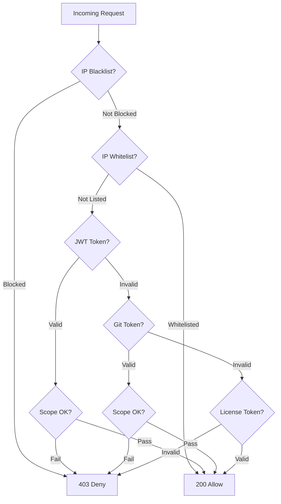

# Authentication & Access Control

Website Defender supports multiple authentication methods to accommodate different access patterns -- from interactive browser sessions to automated machine access.

## JWT Token Authentication

The primary authentication method. Users authenticate via the `/login` endpoint and receive a JWT token.

- Tokens are issued in the `Defender-Authorization` response header
- Token expiration is configurable (default: 24 hours)
- The JWT secret can be set in `config/config.yaml`; if left empty, a random key is generated on each restart

!!! warning "JWT Secret in Production"
    Always set a stable `jwt-secret` in production. An empty secret causes tokens to be invalidated on every application restart.

```yaml
security:
  jwt-secret: "your-secure-secret-here"
  token-expiration-hours: 24
```

## Cookie-based Authentication

For seamless browser sessions, Website Defender also supports authentication via the `flmelody.token` cookie. This allows users to navigate between protected applications without re-authenticating, as long as they share the same cookie domain.

## Git Token Authentication

Designed for machine access (CI/CD pipelines, scripts, automated tools). Git tokens are sent via a configurable HTTP header (default: `Defender-Git-Token`).

- Token format: `username:token`
- Tokens are auto-generated per user via the admin dashboard
- One-click copy for easy integration

!!! tip "Use Git Tokens for Automation"
    Git tokens are ideal for integrating with tools like Git clients, CI runners, or monitoring systems that need to access protected services without interactive login.

## License Token Authentication

API access via a configurable HTTP header (default: `Defender-License`). License tokens provide a simplified authentication mechanism for third-party integrations.

- Tokens are generated via the admin dashboard
- Shown only once at creation time -- store them securely
- Stored as SHA-256 hashes in the database for security
- Can be activated or revoked via the admin dashboard

!!! note "License vs Git Tokens"
    License tokens do not carry user identity and are not subject to domain scope checks. Use Git tokens when you need per-user access control and scope restrictions.

## IP Whitelist

Specific IP addresses or CIDR ranges can be whitelisted to bypass all authentication checks. Whitelisted IPs are granted access immediately without any token validation.

For details, see [IP Lists](ip-lists.md).

## IP Blacklist

Malicious or unwanted IP addresses can be blacklisted by exact match or CIDR range. Blacklisted IPs are denied before any other checks run.

For details, see [IP Lists](ip-lists.md).

## Domain Scope Access Control

Users can be restricted to specific protected domains using scope patterns. This enables multi-tenant access control where different users access different services behind the same Defender instance.

For details, see [Domain Scopes](domain-scopes.md).

## Auth Verification Flow

When the `/auth` endpoint receives a request, it evaluates the following checks in order:

```
IP Blacklist → IP Whitelist → JWT Token (+ Scope Check) → Git Token (+ Scope Check) → License Token → Deny
```



The flow short-circuits at the first definitive result. A blacklisted IP is immediately denied; a whitelisted IP is immediately allowed without token checks.
