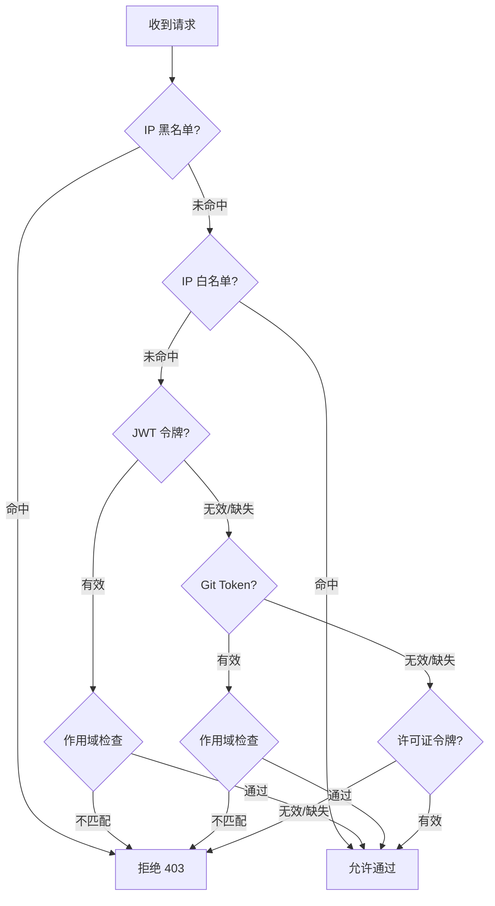

# 认证与访问控制

Website Defender 提供多层认证机制，满足不同场景下的访问控制需求。

## JWT 令牌认证

安全的登录验证机制，支持可配置的令牌过期时间。

- 用户通过 `/login` 端点登录后获取 JWT 令牌
- 令牌通过 `Defender-Authorization` 请求头传递
- 令牌过期时间可通过 `security.token-expiration-hours` 配置（默认 24 小时）
- JWT 密钥可通过 `security.jwt-secret` 配置，留空则每次重启随机生成

!!! warning "生产环境配置"
    在生产环境中，务必设置 `security.jwt-secret`，否则每次重启后已签发的令牌将失效。

## Cookie 认证

支持 `flmelody.token` Cookie，实现无缝的浏览器会话。

- 登录成功后，令牌自动写入 Cookie
- 浏览器后续请求自动携带 Cookie，无需手动管理令牌
- 适合 Web 端交互式访问场景

## Git Token 认证

为机器访问（CI/CD、自动化脚本等）设计的认证方式。

- 通过可配置的 HTTP 请求头传递（默认 `Defender-Git-Token`）
- 令牌格式为 `username:token`
- Git Token 通过管理后台为每个用户生成
- 支持[域名作用域](domain-scopes.md)检查

!!! tip "使用场景"
    Git Token 适合用于 CI/CD 管道、自动化脚本、API 客户端等需要非交互式认证的场景。

## 许可证令牌认证

为 API 和机器访问设计的简化认证方式。

- 通过可配置的 HTTP 请求头传递（默认 `Defender-License`）
- 令牌以 SHA-256 哈希形式安全存储，原始令牌仅在生成时显示一次
- 通过管理后台生成、激活和吊销
- 详细管理说明请参阅 [用户管理](user-management.md)

## IP 白名单

允许特定 IP 或 CIDR 网段直接跳过认证。

- 支持精确 IP 匹配（如 `192.168.1.100`）
- 支持 CIDR 网段匹配（如 `192.168.1.0/24`）
- 白名单命中后直接放行，跳过后续所有认证检查

详细说明请参阅 [IP 黑白名单](ip-lists.md)。

## IP 黑名单

通过精确匹配或 CIDR 网段封禁恶意 IP。

- 黑名单优先级最高，命中即拒绝访问
- 支持精确 IP 和 CIDR 网段
- 通过管理后台或 API 管理

详细说明请参阅 [IP 黑白名单](ip-lists.md)。

## 域名作用域访问控制

通过逗号分隔的域名模式限制用户可访问的域名（如 `gitea.com, *.internal.org`）。

- 作用域为空则不限制访问
- 管理员用户跳过作用域检查
- 域名通过 `X-Forwarded-Host` 请求头获取，回退到 `Host` 请求头

详细说明请参阅 [域名作用域](domain-scopes.md)。

---

## 认证验证流程

当请求到达 `/auth` 端点时，Defender 按以下顺序执行认证检查：



**简化表示：**

```
IP 黑名单 → IP 白名单 → JWT 令牌（+ 作用域检查） → Git Token（+ 作用域检查） → 许可证令牌 → 拒绝
```

!!! note "认证优先级说明"
    - **IP 黑名单**优先级最高，命中即拒绝，不再检查其他认证方式
    - **IP 白名单**命中后直接放行，跳过所有令牌认证
    - 多种令牌认证按顺序尝试，任意一种通过即放行
    - **管理员用户**始终跳过域名作用域检查，无论其作用域值如何

---

## 相关页面

- [域名作用域](domain-scopes.md) - 多租户访问控制详解
- [IP 黑白名单](ip-lists.md) - IP 访问控制详解
- [用户管理](user-management.md) - 用户和许可证管理
- [配置说明](../configuration/index.md) - 安全相关配置项
