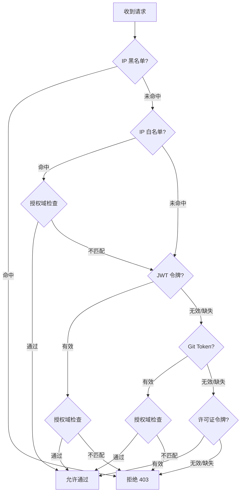

# 认证与访问控制

Website Defender 提供多层认证机制，满足不同场景下的访问控制需求。

## JWT 令牌认证

安全的登录验证机制，支持可配置的令牌过期时间。

- 用户通过 `/login` 端点登录后获取 JWT 令牌（管理后台使用 `/admin-login`，仅管理员可用）
- 令牌通过 `Defender-Authorization` 请求头传递
- 令牌过期时间可通过 `security.token-expiration-hours` 配置（默认 24 小时）
- JWT 密钥可通过 `security.jwt-secret` 配置，留空则每次重启随机生成

!!! warning "生产环境配置"
    在生产环境中，务必设置 `security.jwt-secret`，否则每次重启后已签发的令牌将失效。

## 双因素认证 (2FA)

Website Defender 支持基于 TOTP 的双因素认证，适用于管理后台和 Guard 登录。启用 2FA 后，用户在输入用户名和密码后，还需要提供认证器应用（Google Authenticator、Authy 等）生成的 6 位验证码。

- 支持通过管理后台为每个用户启用 2FA
- 兼容主流 TOTP 认证器应用（Google Authenticator、Authy、Microsoft Authenticator 等）
- 同时适用于 `/login`（Guard 登录）和 `/admin-login`（管理后台登录）流程
- 管理员可以通过管理后台为任何用户重置 2FA

### 2FA 恢复机制

如果管理员丢失了认证器应用的访问权限，且没有其他管理员可以重置其 2FA，可以使用**基于配置的恢复机制**：

1. 在 `config/config.yaml` 中设置 `admin-recovery-key`
2. 调用 `POST /admin-recover-2fa`，传入管理员的用户名、密码和恢复密钥
3. 管理员的 2FA 将被重置，可以仅使用用户名和密码登录

```yaml
security:
  admin-recovery-key: "your-secret-recovery-key"
  admin-recovery-local-only: true  # 限制为仅本地访问（推荐）
```

!!! warning "恢复密钥安全性"
    - 默认情况下，恢复端点仅接受来自**本地**的请求（`admin-recovery-local-only: true`）。即使密钥泄露也能防止远程利用。
    - 将 `admin-recovery-key` 留空可完全禁用恢复端点。
    - 恢复端点除恢复密钥外，还需要验证正确的用户名和密码。

### 受信任设备

成功完成 2FA 验证后，用户可以选择将当前设备标记为受信任设备。受信任设备会通过 Cookie 存储一个安全令牌，在可配置的有效期内登录时可跳过 2FA 验证。

- 默认信任期限：**7 天**
- 通过 `config/config.yaml` 中的 `security.trusted-device-days` 配置
- 设置为 `0` 可完全禁用受信任设备功能（每次登录都需要 2FA 验证）
- 当用户的 2FA 被禁用或重置时，该用户所有的受信任设备令牌会自动失效

```yaml
security:
  trusted-device-days: 7  # 设置为 0 可禁用
```

!!! note "工作原理"
    每次登录时，如果请求中包含有效的受信任设备令牌，服务器会在数据库中进行验证。如果令牌有效且未过期，则跳过 2FA 直接签发 JWT。当用户完成 2FA 验证并选择信任该设备时，系统会生成一个加密随机令牌，将其与过期时间一起存储到数据库中，并返回给客户端。

2FA 管理的详细操作请参阅[用户管理](user-management.md)。

## Cookie 认证

支持 `flmelody.token` Cookie，实现无缝的浏览器会话。

- 登录成功后，令牌自动写入 Cookie
- 浏览器后续请求自动携带 Cookie，无需手动管理令牌
- 适合 Web 端交互式访问场景

## Git Token 认证

为机器访问（CI/CD、自动化脚本等）设计的认证方式。

- 通过可配置的 HTTP 请求头传递（默认 `Defender-Git-Token`）
- 令牌格式为 `username:token`
- Git Token 通过管理后台为每个用户生成
- 支持[授权域](authorized-domains.md)检查

!!! tip "使用场景"
    Git Token 适合用于 CI/CD 管道、自动化脚本、API 客户端等需要非交互式认证的场景。

### 自动信任（临时白名单）

当请求通过 Git Token 认证成功后，客户端 IP 会被自动添加到请求域名的**临时白名单**中。该临时条目有效期为 300 秒（5 分钟），每次从同一 IP 发起的 Git Token 认证都会自动续期。

此机制旨在提升 Git 操作（如 `git clone` 或 `git push`）的性能，这些操作通常会触发大量连续的 HTTP 请求。在首次 Git Token 认证通过后，后续来自同一 IP 的请求会命中白名单，直接跳过令牌验证。

- 临时白名单条目仅对原始请求的特定域名有效
- 条目在 5 分钟无活动后自动过期
- 如果已存在覆盖该 IP 和域名的永久白名单条目，则不会创建临时条目
- 临时条目在管理后台中与常规白名单条目一起显示

## 许可证令牌认证

为 API 和机器访问设计的简化认证方式。

- 通过可配置的 HTTP 请求头传递（默认 `Defender-License`）
- 令牌以 SHA-256 哈希形式安全存储，原始令牌仅在生成时显示一次
- 通过管理后台生成、激活和吊销
- 详细管理说明请参阅 [用户管理](user-management.md)

## IP 白名单

允许特定 IP 或 CIDR 网段直接跳过认证。

- 支持精确 IP 匹配（如 `192.168.1.100`）
- 支持 CIDR 网段匹配（如 `192.168.1.0/24`）
- 白名单命中后直接放行，跳过后续所有认证检查

详细说明请参阅 [IP 黑白名单](ip-lists.md)。

## IP 黑名单

通过精确匹配或 CIDR 网段封禁恶意 IP。

- 黑名单优先级最高，命中即拒绝访问
- 支持精确 IP 和 CIDR 网段
- 通过管理后台或 API 管理

详细说明请参阅 [IP 黑白名单](ip-lists.md)。

## 授权域与访问控制

受保护的域名在[授权域管理](authorized-domains.md)中集中注册。用户可通过授权域模式限制其可访问的域名，实现多租户访问控制。

- **授权域管理**：集中注册和管理所有受保护域名。
- **授权域模式**：逗号分隔的域名模式，通常从授权域中选择（如 `app.example.com, *.internal.org`）。
- 授权域为空则不限制访问
- 管理员用户跳过授权域检查
- 域名通过 `X-Forwarded-Host` 请求头获取，回退到 `Host` 请求头

详细说明请参阅[授权域管理](authorized-domains.md)。

---

## 认证验证流程

当请求到达 `/auth` 端点时，Defender 按以下顺序执行认证检查：



**简化表示：**

```
IP 黑名单 → IP 白名单（+ 授权域检查） → JWT 令牌（+ 授权域检查） → Git Token（+ 授权域检查） → 许可证令牌 → 拒绝
```

!!! note "认证优先级说明"
    - **IP 黑名单**优先级最高，命中即拒绝，不再检查其他认证方式
    - **IP 白名单**命中后检查绑定的授权域，匹配则放行；不匹配则继续令牌认证
    - 多种令牌认证按顺序尝试，任意一种通过即放行
    - **管理员用户**始终跳过授权域检查，无论其授权域配置如何

---

## 相关页面

- [授权域管理](authorized-domains.md) - 集中管理受保护域名及多租户访问控制
- [IP 黑白名单](ip-lists.md) - IP 访问控制详解
- [用户管理](user-management.md) - 用户和许可证管理
- [配置说明](../configuration/index.md) - 安全相关配置项
