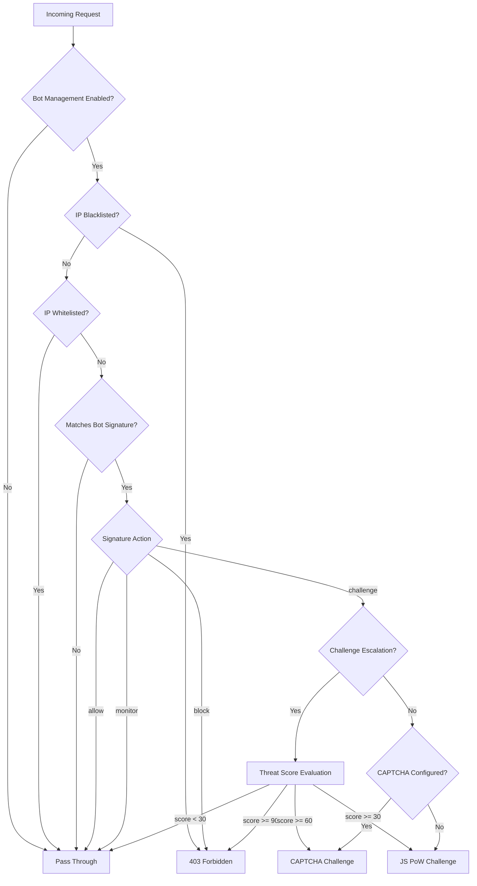

# Bot Management

Website Defender includes a Bot Management system that detects, classifies, and responds to automated traffic using configurable bot signatures. When enabled, incoming requests are matched against a library of regex-based signatures, and the system takes action based on the bot's classification -- allowing legitimate crawlers, challenging suspicious visitors with CAPTCHA or JS Proof-of-Work, and blocking known malicious bots.

## How It Works



1. **Signature Matching** -- Each request's User-Agent (or headers) is checked against enabled bot signatures using regex patterns
2. **Action Dispatch** -- The matched signature determines the response: `allow`, `block`, `challenge`, or `monitor`
3. **Challenge Delivery** -- When the action is `challenge`, the visitor is presented with a CAPTCHA or JS Proof-of-Work depending on configuration
4. **Pass Cookie** -- After solving a CAPTCHA, a signed `owd_captcha_pass` cookie is issued so the visitor is not challenged again for the configured TTL

## Bot Signatures

Bot signatures are the core of the detection engine. Each signature is a database record with the following fields:

| Field | Description | Values |
|-------|-------------|--------|
| **Name** | Human-readable identifier | e.g., `Googlebot`, `SemrushBot` |
| **Pattern** | Regex pattern for matching | e.g., `(?i)googlebot`, `(?i)semrush` |
| **Match Target** | What to match against | `ua` (User-Agent) or `header` (any header value) |
| **Category** | Bot classification | `search_engine`, `good_bot`, `malicious` |
| **Action** | What to do on match | `allow`, `block`, `challenge`, `monitor` |
| **Enabled** | Whether the signature is active | `true` / `false` |

### Actions

- **allow** -- Let the request through without any challenge. Used for verified search engine crawlers and known good bots.
- **block** -- Immediately return 403 Forbidden.
- **challenge** -- Present a CAPTCHA or JS Proof-of-Work challenge (see [Challenge Escalation](#challenge-escalation) below).
- **monitor** -- Log the detection but let the request through. Useful for observing bot traffic before deciding on an action.

### Search Engine Verification

When a signature has `category: search_engine` and `action: allow`, the system performs reverse DNS verification to confirm the bot is genuine. For example, a request claiming to be Googlebot must resolve to a `*.googlebot.com` or `*.google.com` hostname. If verification fails, the action is automatically upgraded to `block`.

Supported search engines for DNS verification:

- Google (`*.googlebot.com`, `*.google.com`)
- Bing (`*.search.msn.com`)
- Yahoo (`*.crawl.yahoo.net`)
- Baidu (`*.crawl.baidu.com`, `*.baidu.jp`)

!!! info "DNS Verification Timeout"
    Reverse DNS lookups have a 3-second timeout. If the lookup times out, the bot is treated as unverified and blocked.

## CAPTCHA Providers

When a bot signature triggers a `challenge` action and CAPTCHA is configured, visitors see a CAPTCHA verification page. Two providers are supported:

### Built-in CAPTCHA

A self-hosted image CAPTCHA that requires no external service. It generates a 5-digit code rendered as a PNG image.

- No third-party dependencies
- Works fully offline
- Image dimensions: 240 x 80 pixels

### Cloudflare Turnstile

A privacy-focused, non-interactive CAPTCHA from Cloudflare. Requires a Turnstile site key and secret key from the [Cloudflare dashboard](https://dash.cloudflare.com/turnstile).

- Non-interactive (invisible challenge in most cases)
- Privacy-preserving
- Requires internet connectivity to Cloudflare's verification endpoint

!!! tip "Choosing a Provider"
    Use **builtin** for air-gapped or self-contained deployments. Use **turnstile** for public-facing sites where a smoother user experience is preferred.

### Degradation Behavior

If CAPTCHA is not properly configured (e.g., missing site key for Turnstile, or unknown provider), the system automatically degrades to a JS Proof-of-Work challenge instead.

## Challenge Escalation

When challenge escalation is enabled, the system uses the IP's [threat score](threat-detection.md) to determine the appropriate challenge level, instead of always showing the same challenge type.

| Threat Score | Action |
|-------------|--------|
| >= 90 | **Block** -- 403 Forbidden |
| >= 60 | **CAPTCHA** -- Full CAPTCHA challenge |
| >= 30 | **JS Challenge** -- Proof-of-Work |
| < 30 | **Allow** -- No challenge |

This provides a graduated response: low-risk visitors get a lightweight JS challenge (or no challenge at all), while high-risk IPs face a full CAPTCHA or outright block.

!!! note "Escalation vs. Fixed Challenge"
    Without escalation enabled, all challenged bots receive the same treatment: CAPTCHA if configured, JS Proof-of-Work otherwise.

## CAPTCHA Pass Cookie

After successfully solving a CAPTCHA, the visitor receives a signed `owd_captcha_pass` cookie containing:

- The visitor's IP address
- A Unix timestamp
- An HMAC signature

The cookie is validated on subsequent requests: the IP must match and the signature must be valid. This prevents cookie replay from different IPs.

| Cookie Property | Value |
|----------------|-------|
| Name | `owd_captcha_pass` |
| HttpOnly | Yes |
| SameSite | Lax |
| Default TTL | 86400 seconds (24 hours) |

## Middleware Integration

Bot Management runs as part of the global middleware chain. The execution order is:

1. **Access Log** -- Records all requests
2. **Geo-IP Blocking** -- Country/region-based blocking
3. **WAF (Request Filtering)** -- SQLi/XSS/path traversal detection
4. **Bot Management** -- Signature matching and action dispatch
5. **CAPTCHA Page** -- Renders CAPTCHA challenge if `bot_captcha` flag is set
6. **Rate Limiter** -- Global rate limiting
7. **JS Challenge** -- Serves JS Proof-of-Work if `waf_challenge` flag is set

The Bot Management middleware communicates with downstream middleware via Gin context flags:

- `bot_captcha: true` -- Tells the CAPTCHA Page middleware to render a CAPTCHA
- `waf_challenge: true` -- Tells the JS Challenge middleware to serve a Proof-of-Work page
- `bot_detected: true` -- Marks the request as having matched a bot signature (for logging)

!!! warning "Middleware Order Matters"
    Blacklisted IPs are blocked before bot signature matching. Whitelisted IPs bypass bot management entirely. This means IP lists always take priority over bot signatures.

## Bypass Conditions

The following requests skip bot management challenges:

- **Blacklisted IPs** -- Blocked immediately (403), before signature matching
- **Whitelisted IPs** -- Skip all bot checks and pass through
- **CAPTCHA endpoints** -- `/captcha/generate` and `/captcha/verify` are exempt from challenge rendering to avoid circular blocking
- **Non-GET requests** -- Only GET requests are intercepted by the CAPTCHA page middleware; POST requests to verification endpoints pass through
- **Valid CAPTCHA pass cookie** -- Visitors who already solved a CAPTCHA within the cookie TTL

## Configuration

Bot Management settings are split between the config file (initial defaults) and the database (runtime settings managed via the admin dashboard).

### Config File (`config.yaml`)

```yaml
bot-management:
  # Enable bot management (overridden by DB setting at runtime)
  enabled: false
  # Use threat-score-based challenge escalation
  challenge-escalation: false
  captcha:
    # Provider: builtin | turnstile
    provider: "builtin"
    # Cloudflare Turnstile keys (only needed for turnstile provider)
    site-key: ""
    secret-key: ""
    # CAPTCHA pass cookie TTL in seconds (default: 24 hours)
    cookie-ttl: 86400
```

### Runtime Settings (Admin Dashboard)

All bot management settings can be changed at runtime through the admin dashboard under **System Settings**:

- **Bot Management Enabled** -- Toggle the entire feature on/off
- **Challenge Escalation** -- Toggle threat-score-based challenge escalation
- **CAPTCHA Provider** -- Select `builtin` or `turnstile`
- **CAPTCHA Site Key** -- Turnstile site key
- **CAPTCHA Secret Key** -- Turnstile secret key
- **CAPTCHA Cookie TTL** -- How long a solved CAPTCHA remains valid

Runtime settings are stored in the database and take effect immediately without restart.

## Admin Dashboard

### Bot Signatures Management

The admin dashboard provides a full CRUD interface for managing bot signatures at the `/bot-signatures` API endpoint:

- **Create** signatures with name, regex pattern, match target, category, and action
- **List** all signatures with pagination
- **Update** any signature field (pattern changes are validated for regex correctness)
- **Delete** signatures that are no longer needed
- **Enable/Disable** individual signatures without deleting them

!!! tip "Testing Signatures"
    Use the `monitor` action to test a new signature pattern before switching to `block` or `challenge`. Check the [Access Logs](access-logs.md) to verify the signature matches the intended traffic.

### API Endpoints

| Method | Endpoint | Description |
|--------|----------|-------------|
| `POST` | `/bot-signatures` | Create a new bot signature |
| `GET` | `/bot-signatures` | List signatures (paginated) |
| `PUT` | `/bot-signatures/:id` | Update a signature |
| `DELETE` | `/bot-signatures/:id` | Delete a signature |

All endpoints require admin authentication.

---

## Related Pages

- [Threat Detection](threat-detection.md) -- Threat scoring used by challenge escalation
- [JS Challenge](js-challenge.md) -- Proof-of-Work challenge served as fallback
- [IP Lists](ip-lists.md) -- Blacklist/whitelist that override bot management
- [WAF Rules](waf.md) -- Request filtering that runs before bot management
- [Security Events](security-events.md) -- Bot detections are recorded as security events
- [Access Logs](access-logs.md) -- View bot detection details in request logs
