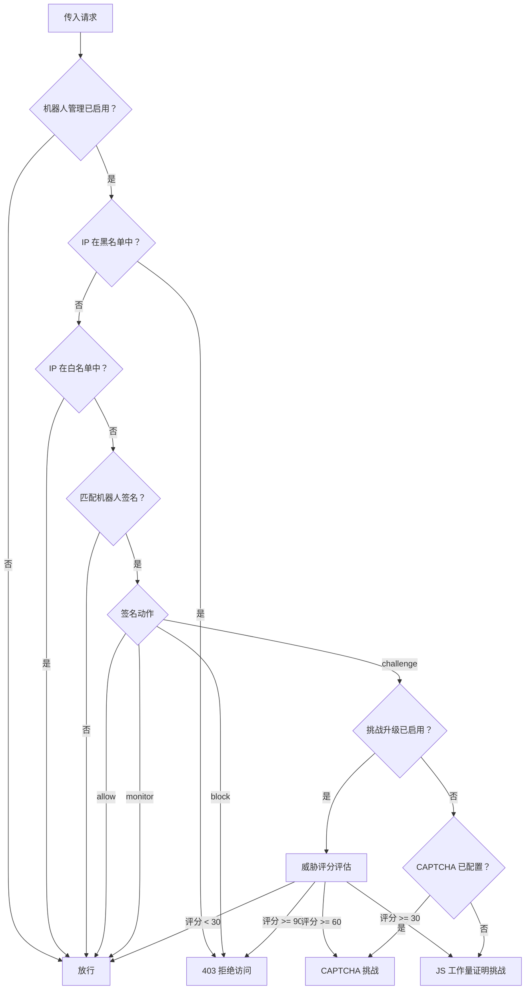

# 机器人管理

Website Defender 内置了一套机器人管理系统，通过可配置的机器人签名对自动化流量进行检测、分类和响应。启用后，所有传入请求将与正则表达式签名库进行匹配，系统根据机器人的分类采取相应措施——放行合法爬虫、向可疑访问者发起 CAPTCHA 或 JS 工作量证明挑战、直接封锁已知恶意机器人。

## 工作原理



1. **签名匹配** -- 检查每个请求的 User-Agent（或请求头）是否匹配已启用的机器人签名正则表达式
2. **动作分发** -- 根据匹配签名的动作执行对应操作：`allow`（放行）、`block`（封锁）、`challenge`（挑战）、`monitor`（监控）
3. **挑战交付** -- 当动作为 `challenge` 时，根据配置向访问者展示 CAPTCHA 验证或 JS 工作量证明
4. **通行 Cookie** -- 通过 CAPTCHA 验证后，系统签发 `owd_captcha_pass` Cookie，在有效期内无需再次验证

## 机器人签名

机器人签名是检测引擎的核心，每条签名作为数据库记录存储，包含以下字段：

| 字段 | 说明 | 可选值 |
|------|------|--------|
| **Name** | 可读标识名称 | 如 `Googlebot`、`SemrushBot` |
| **Pattern** | 匹配用正则表达式 | 如 `(?i)googlebot`、`(?i)semrush` |
| **Match Target** | 匹配目标 | `ua`（User-Agent）或 `header`（任意请求头值） |
| **Category** | 机器人分类 | `search_engine`、`good_bot`、`malicious` |
| **Action** | 匹配后的动作 | `allow`、`block`、`challenge`、`monitor` |
| **Enabled** | 是否启用 | `true` / `false` |

### 动作说明

- **allow** -- 直接放行，不做任何挑战。适用于已验证的搜索引擎爬虫和已知的合法机器人。
- **block** -- 立即返回 403 拒绝访问。
- **challenge** -- 发起 CAPTCHA 或 JS 工作量证明挑战（参见下方[挑战升级](#挑战升级)）。
- **monitor** -- 仅记录检测结果，放行请求。适合在正式启用封锁前先观察流量。

### 搜索引擎验证

当签名的 `category` 为 `search_engine` 且 `action` 为 `allow` 时，系统会执行反向 DNS 验证以确认爬虫身份的真实性。例如，声称为 Googlebot 的请求必须解析到 `*.googlebot.com` 或 `*.google.com` 域名。验证失败时，动作自动升级为 `block`。

支持 DNS 验证的搜索引擎：

- Google（`*.googlebot.com`、`*.google.com`）
- Bing（`*.search.msn.com`）
- Yahoo（`*.crawl.yahoo.net`）
- Baidu（`*.crawl.baidu.com`、`*.baidu.jp`）

!!! info "DNS 验证超时"
    反向 DNS 查询设有 3 秒超时。查询超时的机器人将被视为未验证并予以封锁。

## CAPTCHA 验证方式

当机器人签名触发 `challenge` 动作且 CAPTCHA 已配置时，访问者将看到验证页面。系统支持两种验证方式：

### 内置 CAPTCHA

自托管的图形验证码，无需依赖外部服务。生成 5 位数字的 PNG 验证图片。

- 无第三方依赖
- 完全离线运行
- 图片尺寸：240 x 80 像素

### Cloudflare Turnstile

Cloudflare 提供的隐私优先、非交互式验证方案。需要从 [Cloudflare 控制台](https://dash.cloudflare.com/turnstile) 获取 Turnstile 站点密钥和验证密钥。

- 大多数情况下为非交互式（隐式挑战）
- 注重隐私保护
- 需要网络连接到 Cloudflare 验证端点

!!! tip "选择验证方式"
    对于隔离网络或完全自包含的部署环境，使用**内置 CAPTCHA**（builtin）。对于面向公众的网站，推荐使用 **Turnstile** 以获得更流畅的用户体验。

### 降级行为

当 CAPTCHA 未正确配置（如 Turnstile 缺少站点密钥，或提供者未知）时，系统自动降级为 JS 工作量证明挑战。

## 挑战升级

启用挑战升级后，系统根据 IP 的[威胁评分](threat-detection.md)动态决定挑战等级，而非始终展示相同类型的挑战。

| 威胁评分 | 处置方式 |
|---------|---------|
| >= 90 | **封锁** -- 403 拒绝访问 |
| >= 60 | **CAPTCHA** -- 完整验证码挑战 |
| >= 30 | **JS 挑战** -- 工作量证明 |
| < 30 | **放行** -- 无需挑战 |

这提供了一种渐进式响应机制：低风险访问者只需完成轻量级 JS 挑战（或无需挑战），而高风险 IP 则面临完整 CAPTCHA 验证或直接封锁。

!!! note "升级模式与固定模式"
    未启用挑战升级时，所有被挑战的机器人都接受相同处理：已配置 CAPTCHA 则展示 CAPTCHA，否则展示 JS 工作量证明。

## CAPTCHA 通行 Cookie

成功通过 CAPTCHA 验证后，访问者会收到一个签名的 `owd_captcha_pass` Cookie，包含：

- 访问者 IP 地址
- Unix 时间戳
- HMAC 签名

后续请求中会验证该 Cookie：IP 必须匹配且签名必须有效，防止从不同 IP 重放 Cookie。

| Cookie 属性 | 值 |
|------------|---|
| 名称 | `owd_captcha_pass` |
| HttpOnly | 是 |
| SameSite | Lax |
| 默认有效期 | 86400 秒（24 小时） |

## 中间件集成

机器人管理作为全局中间件链的一部分运行，执行顺序如下：

1. **访问日志** -- 记录所有请求
2. **地域封锁** -- 基于国家/地区的访问封锁
3. **WAF（请求过滤）** -- SQL 注入/XSS/路径遍历检测
4. **机器人管理** -- 签名匹配与动作分发
5. **CAPTCHA 页面** -- 当 `bot_captcha` 标志被设置时渲染 CAPTCHA 挑战
6. **速率限制** -- 全局速率限制
7. **JS 挑战** -- 当 `waf_challenge` 标志被设置时提供工作量证明页面

机器人管理中间件通过 Gin 上下文标志与下游中间件通信：

- `bot_captcha: true` -- 通知 CAPTCHA 页面中间件渲染验证码
- `waf_challenge: true` -- 通知 JS 挑战中间件提供工作量证明页面
- `bot_detected: true` -- 标记请求匹配了机器人签名（用于日志记录）

!!! warning "中间件顺序很重要"
    黑名单 IP 在签名匹配之前即被封锁，白名单 IP 完全绕过机器人管理。也就是说，IP 名单始终优先于机器人签名。

## 跳过挑战的情况

以下请求会跳过机器人管理挑战：

- **黑名单 IP** -- 在签名匹配之前直接封锁（403）
- **白名单 IP** -- 跳过所有机器人检查，直接放行
- **CAPTCHA 端点** -- `/captcha/generate` 和 `/captcha/verify` 免于挑战拦截，避免循环封锁
- **非 GET 请求** -- CAPTCHA 页面中间件仅拦截 GET 请求，验证端点的 POST 请求正常通过
- **有效 CAPTCHA 通行 Cookie** -- 在 Cookie 有效期内已通过验证的访问者

## 配置

机器人管理的设置分为配置文件（初始默认值）和数据库（通过管理后台管理的运行时设置）两部分。

### 配置文件（`config.yaml`）

```yaml
bot-management:
  # 启用机器人管理（运行时由数据库设置覆盖）
  enabled: false
  # 启用基于威胁评分的挑战升级
  challenge-escalation: false
  captcha:
    # 验证方式：builtin（内置）| turnstile
    provider: "builtin"
    # Cloudflare Turnstile 密钥（仅 turnstile 方式需要）
    site-key: ""
    secret-key: ""
    # CAPTCHA 通行 Cookie 有效期（秒），默认 24 小时
    cookie-ttl: 86400
```

### 运行时设置（管理后台）

所有机器人管理设置均可通过管理后台的**系统设置**页面实时修改：

- **机器人管理开关** -- 启用或禁用整个功能
- **挑战升级** -- 启用或禁用基于威胁评分的挑战升级
- **CAPTCHA 验证方式** -- 选择 `builtin` 或 `turnstile`
- **CAPTCHA 站点密钥** -- Turnstile 站点密钥
- **CAPTCHA 验证密钥** -- Turnstile 验证密钥
- **CAPTCHA Cookie 有效期** -- 验证通过后的有效时长

运行时设置存储在数据库中，修改后立即生效，无需重启。

## 管理后台

### 机器人签名管理

管理后台通过 `/bot-signatures` API 端点提供完整的签名增删改查功能：

- **创建** 签名，包括名称、正则表达式、匹配目标、分类和动作
- **列表** 查看所有签名，支持分页
- **更新** 签名的任意字段（正则表达式变更会进行语法校验）
- **删除** 不再需要的签名
- **启用/禁用** 单条签名，无需删除

!!! tip "测试签名"
    使用 `monitor` 动作测试新签名的匹配效果，确认无误后再切换为 `block` 或 `challenge`。通过[访问日志](access-logs.md)验证签名是否匹配了预期的流量。

### API 端点

| 方法 | 端点 | 说明 |
|------|------|------|
| `POST` | `/bot-signatures` | 创建机器人签名 |
| `GET` | `/bot-signatures` | 列表查询（分页） |
| `PUT` | `/bot-signatures/:id` | 更新签名 |
| `DELETE` | `/bot-signatures/:id` | 删除签名 |

所有端点均需管理员认证。

---

## 相关页面

- [威胁检测](threat-detection.md) -- 挑战升级所依据的威胁评分机制
- [JS 挑战](js-challenge.md) -- 作为降级方案的工作量证明挑战
- [IP 黑白名单](ip-lists.md) -- 优先于机器人管理的 IP 名单
- [WAF 规则](waf.md) -- 在机器人管理之前运行的请求过滤
- [安全事件](security-events.md) -- 机器人检测结果记录为安全事件
- [访问日志](access-logs.md) -- 在请求日志中查看机器人检测详情
