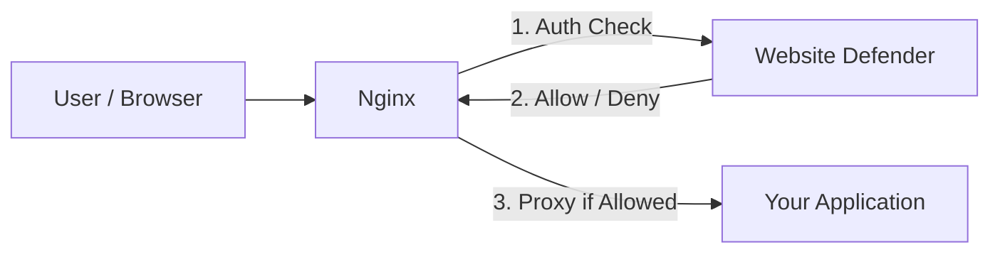

# Website Defender

## Protect Your Internal Applications in Minutes

**Website Defender** is a lightweight, open-source WAF (Web Application Firewall) that adds unified authentication, access control, and security policies to any web application -- without modifying a single line of your application code.

Deploy once, protect everything: Gitlab, Jenkins, Prometheus, Nexus, Nacos, and any other web service.

---

## Why Website Defender?

Enterprises expose internal tools to the internet every day. These applications often lack:

- **Unified authentication** -- each tool has its own login, or none at all
- **Brute-force protection** -- no rate limiting on login endpoints
- **Security hardening** -- missing WAF rules, security headers, and IP controls

Website Defender solves all of these with a single binary that integrates transparently with Nginx.

---

## How It Works

Website Defender uses Nginx's `auth_request` module to intercept every request before it reaches your application:



No code changes needed. No SDK to integrate. Just configure Nginx and deploy.

[Learn more about the architecture](architecture/index.md){ .md-button }

---

## What You Get

### Multi-Layer Authentication

Multiple auth methods for different use cases -- browser sessions, CI/CD pipelines, API integrations:

- **JWT Token** -- secure login with configurable expiration via `Defender-Authorization` header
- **Cookie-based** -- seamless browser sessions via `flmelody.token` cookie
- **Git Token** -- machine access for CI/CD, format `username:token`
- **License Token** -- API access with SHA-256 hashed storage

[Authentication details](features/authentication.md){ .md-button .md-button--primary }

### Web Application Firewall

9 built-in rules covering the most common attack vectors, with custom rule support:

| Category | Protection |
|----------|------------|
| **SQL Injection** | UNION SELECT, DROP/ALTER/DELETE, boolean bypass, comment injection |
| **XSS** | Script tags, event handlers, javascript: protocol |
| **Path Traversal** | `../` variants, sensitive file access (`/etc/passwd`, `/proc/self`) |

Each rule can `block` (return 403) or `log` (allow but record). Add your own rules via the admin dashboard.

[WAF details](features/waf.md){ .md-button .md-button--primary }

### Access Control

- **IP Whitelist / Blacklist** -- allow or block by exact IP or CIDR range (e.g. `192.168.1.0/24`)
- **Authorized Domains** -- centrally register protected domains; serves as data source for IP whitelist binding and user access control; enables multi-tenant access control restricting users to specific domains (e.g. `gitea.com, *.internal.org`)
- **Geo-IP Blocking** -- country-level blocking using MaxMind GeoLite2
- **Rate Limiting** -- global (default 100 req/min) and login-specific (default 5/min with auto-lockout)

### Security & Monitoring

- **Security Headers** -- automatic `X-Content-Type-Options`, `X-XSS-Protection`, `Referrer-Policy`, `Permissions-Policy`, configurable `X-Frame-Options` and HSTS
- **Access Logs** -- every request logged with IP, method, path, status, latency, User-Agent, and allow/block action
- **Dashboard Analytics** -- real-time stats, top blocked IPs, filtering by IP/action/status/time

### Production Ready

- **Single binary** -- frontend assets embedded via `go:embed`, just deploy one file
- **Multi-database** -- SQLite (default, zero-config), PostgreSQL, or MySQL
- **Admin Dashboard** -- hacker-themed terminal UI supporting 6 languages (EN, ZH, DE, FR, JA, RU)
- **Graceful shutdown** -- clean SIGINT/SIGTERM handling

---

## Screenshots

### Guard Page (Login Challenge)


### Admin Dashboard


## Demo Video

<div style="position: relative; padding-bottom: 56.25%; height: 0; overflow: hidden;">
  <iframe src="//player.bilibili.com/player.html?bvid=BV1BEZxBEEhJ&autoplay=0" style="position: absolute; top: 0; left: 0; width: 100%; height: 100%;" frameborder="0" allowfullscreen></iframe>
</div>

---

## Get Started in 3 Steps

**1. Build**

```bash
git clone https://github.com/Flmelody/open-website-defender.git
cd open-website-defender
./scripts/build.sh
```

**2. Run**

```bash
./app
```

**3. Configure Nginx**

```nginx
location / {
    auth_request /auth;
    proxy_pass http://your-app;
}

location = /auth {
    internal;
    proxy_pass http://127.0.0.1:9999/wall/auth;
    proxy_set_header X-Forwarded-Host $host;
    proxy_set_header X-Forwarded-For $remote_addr;
    proxy_pass_request_body off;
    proxy_set_header Content-Length "";
}
```

!!! tip "Default Credentials"
    Admin URL: `http://localhost:9999/wall/admin/`
    Username: `defender` / Password: `defender`
    **Change these immediately after first login.**

[Full Getting Started guide](getting-started/index.md){ .md-button .md-button--primary }
[Nginx Setup guide](deployment/nginx-setup.md){ .md-button }

---

## Explore the Docs

- [Getting Started](getting-started/index.md) -- Build, run, and connect to Nginx
- [Architecture](architecture/index.md) -- How Defender works with Nginx and the middleware chain
- [Features](features/authentication.md) -- Authentication, WAF, IP lists, geo-blocking, rate limiting, and more
- [Configuration](configuration/index.md) -- Runtime config.yaml reference
- [API Reference](api-reference/index.md) -- Complete REST API documentation
- [Deployment](deployment/index.md) -- Production deployment and Nginx setup
- [Development](development/index.md) -- Build from source and contribute
