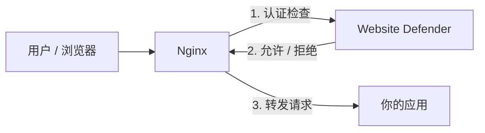
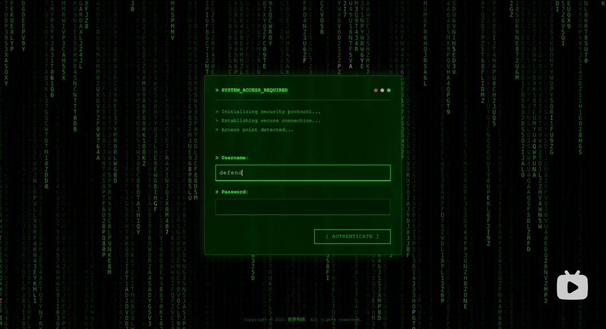

# Website Defender

## 几分钟内保护你的内部应用

**Website Defender** 是一个轻量级、开源的 WAF（Web 应用防火墙），为任何 Web 应用添加统一认证、访问控制和安全策略 -- 无需修改一行应用代码。

一次部署，全面保护：代码仓库、CI/CD 工具、监控面板、包管理器以及任何其他 Web 服务。

---

## 为什么选择 Website Defender？

企业每天都在将内部工具暴露到互联网。这些应用通常面临以下问题：

- **缺少统一认证** -- 每个工具各自为政，甚至没有认证
- **暴力破解风险** -- 登录端点没有速率限制
- **安全加固不足** -- 缺少 WAF 规则、安全响应头和 IP 访问控制

Website Defender 通过一个与 Nginx 透明集成的单一可执行文件，一次解决所有这些问题。

---

## 工作原理

Website Defender 利用 Nginx 的 `auth_request` 模块，在请求到达你的应用之前进行拦截验证：



无需改代码。无需集成 SDK。只需配置 Nginx 然后部署。

[了解更多架构详情](architecture/index.md){ .md-button }

---

## 核心能力

### 多层认证体系

为不同使用场景提供多种认证方式 -- 浏览器会话、CI/CD 管道、API 集成：

- **JWT 令牌** -- 安全登录，支持可配置过期时间，通过 `Defender-Authorization` 请求头传递
- **Cookie 认证** -- 通过 `flmelody.token` Cookie 实现无缝浏览器会话
- **Git Token** -- 机器访问，格式 `username:token`，适合 CI/CD
- **许可证令牌** -- API 访问，令牌以 SHA-256 哈希安全存储

[认证详情](features/authentication.md){ .md-button .md-button--primary }

### Web 应用防火墙

内置 9 条规则覆盖最常见的攻击向量，支持自定义规则：

| 类别 | 防护内容 |
|------|----------|
| **SQL 注入** | UNION SELECT、DROP/ALTER/DELETE、布尔盲注、注释注入 |
| **XSS** | Script 标签、事件处理器、javascript: 协议 |
| **路径穿越** | `../` 变体、敏感文件访问（`/etc/passwd`、`/proc/self`） |

每条规则支持 `block`（返回 403 拦截）或 `log`（放行但记录）。可通过管理后台添加自定义规则。

[WAF 详情](features/waf.md){ .md-button .md-button--primary }

### 访问控制

- **IP 黑白名单** -- 通过精确 IP 或 CIDR 网段（如 `192.168.1.0/24`）允许或封禁；黑名单支持临时封禁和自动过期
- **授权域管理** -- 集中注册受保护域名，作为 IP 白名单域名绑定和用户访问控制的数据源；实现多租户访问控制，限制用户可访问的域名（如 `app.example.com, *.internal.org`）
- **地域封锁** -- 基于 MaxMind GeoLite2 的国家级封锁
- **速率限制** -- 全局限速（默认 100 次/分钟）和登录限速（默认 5 次/分钟，自动锁定）

### 威胁检测与响应

- **[自动威胁检测](features/threat-detection.md)** -- 检测 4xx 洪泛、路径扫描、速率限制滥用和暴力破解；自动封禁攻击 IP，阈值和时长可配置
- **[JS 挑战（工作量证明）](features/js-challenge.md)** -- 提供基于 JavaScript 的挑战过滤机器人；支持 `suspicious` 模式（仅挑战高威胁 IP）和 `all` 模式
- **[安全事件](features/security-events.md)** -- 集中的安全事件日志，支持统计、筛选和 90 天数据保留
- **[Webhook 通知](features/webhook.md)** -- 安全事件发生时向外部系统发送 HTTP POST 告警

### 安全与监控

- **安全响应头** -- 自动附加 `X-Content-Type-Options`、`X-XSS-Protection`、`Referrer-Policy`、`Permissions-Policy`，可配置 `X-Frame-Options` 和 HSTS
- **访问日志** -- 每个请求记录 IP、方法、路径、状态码、延迟、User-Agent 和处理动作；数据实时输入威胁检测引擎
- **仪表盘分析** -- 实时统计、Top 10 被拦截 IP、24 小时自动封禁数、活跃威胁数、按 IP/动作/状态码/时间筛选

### 生产就绪

- **单文件部署** -- 前端资源通过 `go:embed` 嵌入，只需部署一个文件
- **多数据库** -- SQLite（默认，零配置）、PostgreSQL 或 MySQL
- **管理后台** -- 黑客风格终端 UI，支持 6 种语言（英语、中文、德语、法语、日语、俄语）
- **优雅关停** -- 支持 SIGINT/SIGTERM 信号安全退出

---

## 截图预览

### 防护页面（登录挑战）


### 管理后台



## 演示视频

<div style="position: relative; padding-bottom: 56.25%; height: 0; overflow: hidden;">
  <iframe src="//player.bilibili.com/player.html?bvid=BV1BEZxBEEhJ&autoplay=0" style="position: absolute; top: 0; left: 0; width: 100%; height: 100%;" frameborder="0" allowfullscreen></iframe>
</div>

---

## 三步开始使用

**1. 构建**

```bash
git clone https://github.com/Flmelody/open-website-defender.git
cd open-website-defender
./scripts/build.sh
```

**2. 运行**

```bash
./app
```

**3. 配置 Nginx**

```nginx
location / {
    auth_request /auth;
    proxy_pass http://your-app;
}

location = /auth {
    internal;
    proxy_pass http://127.0.0.1:9999/wall/auth;
    proxy_set_header X-Forwarded-Host $host;
    proxy_set_header X-Forwarded-For $remote_addr;
    proxy_set_header X-Original-URI $request_uri;
    proxy_pass_request_body off;
    proxy_set_header Content-Length "";
}
```

!!! tip "默认凭据"
    管理后台地址：`http://localhost:9999/wall/admin/`
    用户名：`defender` / 密码：`defender`
    **请在首次登录后立即修改。**

[完整快速开始指南](getting-started/index.md){ .md-button .md-button--primary }
[Nginx 配置指南](deployment/nginx-setup.md){ .md-button }

---

## 浏览文档

- [快速开始](getting-started/index.md) -- 构建、运行并连接 Nginx
- [架构说明](architecture/index.md) -- Defender 如何与 Nginx 协同工作及中间件链
- [功能特性](features/authentication.md) -- 认证、WAF、IP 名单、地域封锁、速率限制等
- [配置说明](configuration/index.md) -- 运行时 config.yaml 配置参考
- [API 参考](api-reference/index.md) -- 完整的 REST API 接口文档
- [部署指南](deployment/index.md) -- 生产部署和 Nginx 配置
- [开发指南](development/index.md) -- 从源码构建和参与开发
